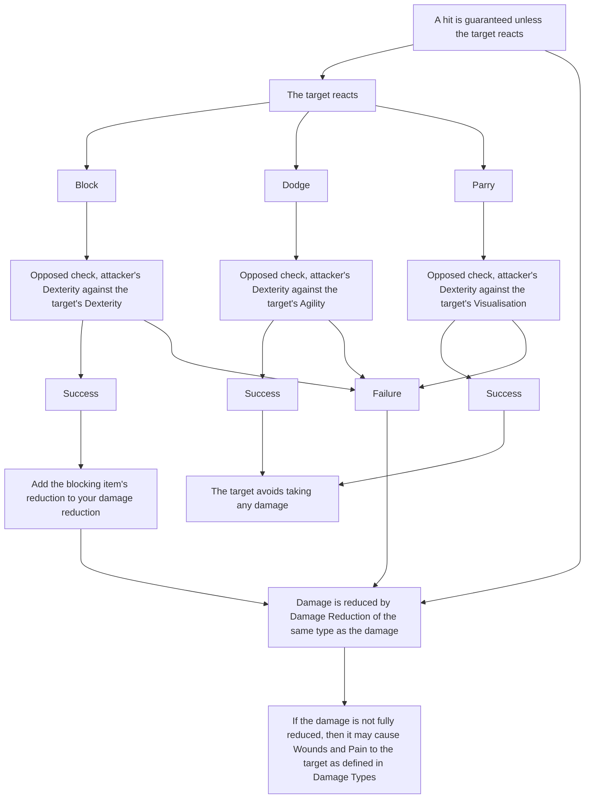

# Attacking

When making an attack, a hit is guaranteed if the target doesn’t attempt to prevent it.

1. Hit is guaranteed, so no attack roll.

2. Defender responds:

 1. Block - Opposed Check Dexterity vs Dexterity

 2. Dodge - Opposed Check Agility vs Dexterity (Requires a shield)

 3. Parry - Opposed Check Visualisation vs Dexterity (Requires a weapon)

3. Damage is Tier x D10 +Tier Bonus +Strength + Weapon Damage

4. Damage is reduced by Damage Reduction of the same type as the damage. 
    Damage Reduction(Any) can be used to reduce any one type of incoming damage per attack.

5. If the Damage is not fully reduced, then it may cause [[Wounds]] and [[Pain]] to the target.

# Flow

# Attacking Objects

Objects should be treated as though attacking a target with no Blood.

Determine the object's reductions by comparing its form against the Armour table and selecting the appropriate material.

# Attacking Weapons and Armour

Any equipment wielded by a creature is usually not subject to being damaged to the point of breaking.